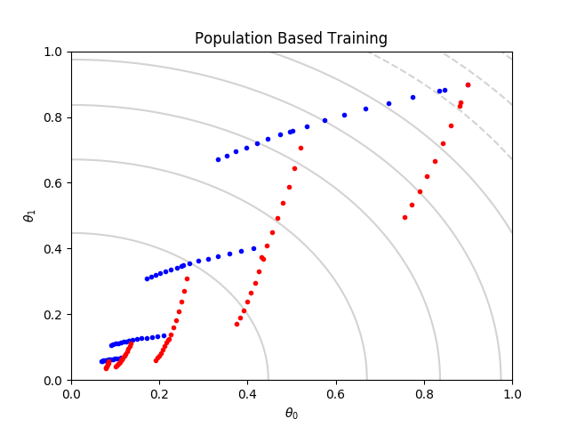
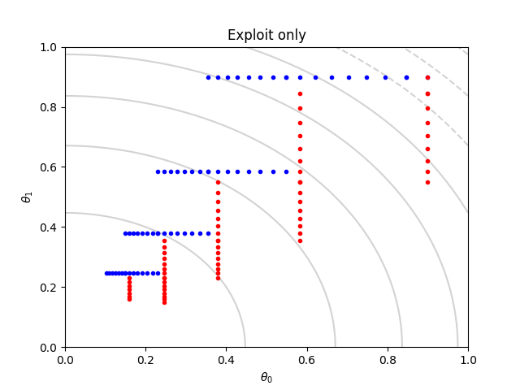
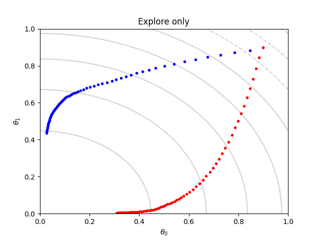
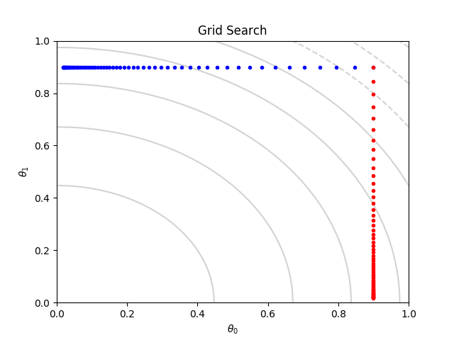

# Population Based Training


## Introduction

This project is an implementation of Population Based Training. 
Population Based Training is an asynchronous optimisation algorithm to optimise a population of models 
and their hyperparameters. The implementation is based on: https://arxiv.org/abs/1711.09846

The project consists of two parts:
   1. Application of Population Based Training on a toy example
   2. Combining the Reinforce algorithm with Population Based Training


## Toy Example
The objective is to maximize the function
```python
   1.2 - (pow(param_0,2) + pow(param_1,2))
```
We assume that we can't observe this function. Instead we maximize a surrogate function 
```python
   1.2 - (hyperparam_0 * pow(param_0,2) + hyperparam_1 * pow(param_1,2))
```








